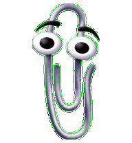
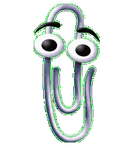
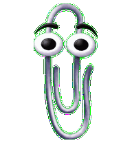
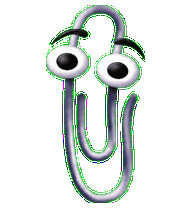
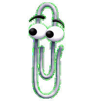
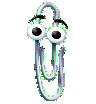
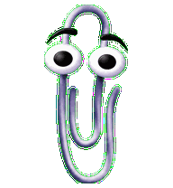
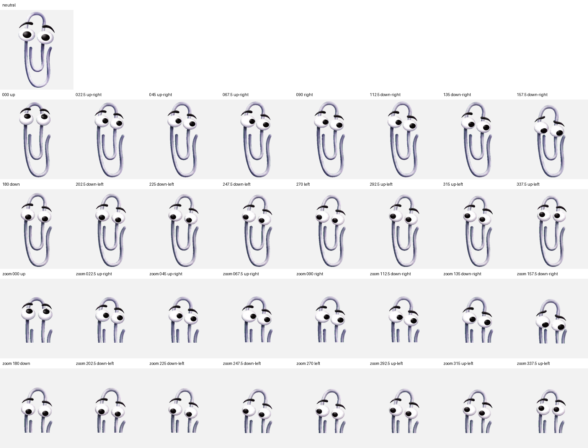

<p align="center">
  
  
  
  
  
</p>

<h1 align="center">Clippy Pet 📎</h1>

<p align="center"><strong>It looks like you're writing code. Would you like a paperclip to watch?</strong><br>
An <em>unofficial</em> animated paperclip pet for the ChatGPT desktop app and Codex CLI.<br>
Nine animation states · sixteen look directions · one-line install on every Unix.</p>

<p align="center">
  <a href="https://adammatthewsteinberger.github.io/clippy-pet/"></a>
  <a href="https://github.com/adammatthewsteinberger/clippy-pet/releases/latest"></a>
  <a href="https://github.com/adammatthewsteinberger/clippy-pet/actions/workflows/validate.yml"></a>
  <a href="https://github.com/adammatthewsteinberger/clippy-pet/actions/workflows/packaging-ci.yml"></a>
  <a href="LICENSE"></a>
</p>

```sh
curl -fsSL https://adammatthewsteinberger.github.io/clippy-pet/install.sh | sh
```

Then pick it: **ChatGPT desktop app → Settings → Pets → Clippy Pet**, or `/pets clippy-pet` in the Codex CLI. That command downloads one 1.5 MB tarball, checks its SHA-256, and copies two files into `~/.codex/pets/clippy-pet/`. No `sudo`, no background process, nothing phones home. [Read the script.](https://adammatthewsteinberger.github.io/clippy-pet/packages/curl/)

## What you get

- **Nine animations** that loop cleanly: idle, waving, jumping, running (right / left / toward you), failed, waiting, review.
- **Sixteen look directions** in 22.5° steps so the eyes follow your pointer (v2 pet contract).
- **Installers, honestly labelled**: one-liner, macOS `.dmg` / `.pkg` / `.app`, Linux `.deb` / `.rpm` / `.apk` / Arch, reproducible tarballs; a [status matrix](https://adammatthewsteinberger.github.io/clippy-pet/packages/) that says which package managers are live and which are still planned.
- **The receipts**: a validator, blind direction QA (11/14 pairs clean, warnings published), semantic review (13/16 pass), continuity and chroma reports, all in [`qa/`](qa/) and explained on the [QA page](https://adammatthewsteinberger.github.io/clippy-pet/how-it-works/qa/).
- **Remixable source** under MIT: per-state frames in [`source/frames/`](source/frames/), plus a payload-agnostic packaging pipeline you can fork to ship your own pet.

## Meet Clippy Pet

| idle | running-right | running-left | waving | jumping |
|:-:|:-:|:-:|:-:|:-:|
|  |  |  |  |  |
| **failed** | **waiting** | **running** | **review** | 16 look directions |
|  |  |  |  | <a href="qa/look-directions.png"></a> |

<details>
<summary><strong>The whole atlas (contact sheet)</strong></summary>


Rows: idle, running-right, running-left, waving, jumping, failed, waiting, running, review, look 000–157.5°, look 180–337.5°. 1536×2288 WebP, 8 columns × 11 rows of 192×208 cells.
</details>

## Install another way

<details>
<summary><strong>macOS</strong> — .dmg with a no-admin app and a system .pkg</summary>

Download `Clippy-Pet-<version>.dmg` from the [latest release](https://github.com/adammatthewsteinberger/clippy-pet/releases/latest). Double-click **Install Clippy Pet.app** (your user only, no admin) or **Clippy-Pet-\<version\>.pkg** (all users). Or `sudo installer -pkg Clippy-Pet-<version>.pkg -target /`. Builds are ad-hoc signed until Apple notarization is enabled, so Gatekeeper wants a right-click → Open. Homebrew/MacPorts: planned. [Details](https://adammatthewsteinberger.github.io/clippy-pet/packages/macos/)
</details>

<details>
<summary><strong>Linux</strong> — .deb / .rpm / .apk / Arch</summary>

```sh
sudo apt install ./clippy-pet_<version>_all.deb              # Debian, Ubuntu…
sudo dnf install ./clippy-pet-<version>-1.noarch.rpm         # Fedora, RHEL; zypper on openSUSE
sudo apk add --allow-untrusted ./clippy-pet_<version>_noarch.apk
sudo pacman -U ./clippy-pet-<version>-1-any.pkg.tar.zst
clippy-pet install                                           # copies the pet into *your* ~/.codex
```

AppImage, Flatpak, Snap, AUR, COPR, Nix: planned. [Details](https://adammatthewsteinberger.github.io/clippy-pet/packages/linux/)
</details>

<details>
<summary><strong>From a checkout, or by hand</strong></summary>

```sh
git clone https://github.com/adammatthewsteinberger/clippy-pet && ./clippy-pet/scripts/install.sh
```

Or copy `pet.json` and `spritesheet.webp` into `${CODEX_HOME:-$HOME/.codex}/pets/clippy-pet/`. That's all any installer does.
</details>

<details>
<summary><strong>ChatGPT on the web</strong> — upload the v1 sheet</summary>

The web uploader takes the older nine-row v1 layout. Grab `spritesheet-v1.webp` from the [latest release](https://github.com/adammatthewsteinberger/clippy-pet/releases/latest) (or `make v1`) and upload it under Settings → Personalization → Pet. All animations, no pointer tracking. [Details](https://adammatthewsteinberger.github.io/clippy-pet/get-started/select/)
</details>

Full guide, per-OS tabs, troubleshooting, and verification (SHA256SUMS, cosign, attestations): **[adammatthewsteinberger.github.io/clippy-pet](https://adammatthewsteinberger.github.io/clippy-pet/)**.

## Make your own pet

The frames, the atlas layout, the validator, and the entire installer/packaging pipeline are reusable. Recolour Clippy Pet or hatch something that isn't a paperclip, then post it in [Show and tell](https://github.com/adammatthewsteinberger/clippy-pet/discussions/categories/show-and-tell). Guide: [Make your own](https://adammatthewsteinberger.github.io/clippy-pet/make/).

## FAQ

**Is this official?** No. Not Microsoft's, not OpenAI's. It implements OpenAI's documented pet file format as a third party, and the paperclip artwork is original. See [NOTICE.md](NOTICE.md).

**Does it run anything in the background?** No. It's a JSON file and an image. The optional Linux login-time `sync` only re-copies the files if a package upgrade changed them, and `clippy-pet autostart disable` turns it off.

**Why don't the eyes move on the web?** Web upload uses the v1 layout, which has no look-direction rows. Desktop app and CLI use v2 and track the pointer.

**Why does macOS warn me?** Builds aren't Apple-notarized yet. Right-click → Open, or use the one-liner. Tracked on the [roadmap](https://adammatthewsteinberger.github.io/clippy-pet/project/roadmap/).

**Where's Homebrew / Nix / AUR / apt repo?** Drafted, not published. The [package managers page](https://adammatthewsteinberger.github.io/clippy-pet/packages/managers/) is the truthful status board.

**Can I uninstall cleanly?** `clippy-pet uninstall` (or delete the directory). Nothing else was written.

## Validate

```sh
python3 -m venv .venv && . .venv/bin/activate
python3 -m pip install -r requirements-dev.txt
make validate      # manifest, contract version, 1536×2288, alpha, path safety, per-cell occupancy
```

## Contributing & community

GitFlow: `develop` is the default branch; `main` is release-only; tags on `main` build releases. Read [CONTRIBUTING.md](CONTRIBUTING.md), be kind per [CODE_OF_CONDUCT.md](CODE_OF_CONDUCT.md), ask in [Discussions](https://github.com/adammatthewsteinberger/clippy-pet/discussions), report bugs in [Issues](https://github.com/adammatthewsteinberger/clippy-pet/issues/new/choose), and report vulnerabilities privately per [SECURITY.md](SECURITY.md). Docs preview: `pip install -r docs/requirements.txt && make docs-serve`.

## License & notice

Copyright © 2026 [Adam Matthew Steinberger](https://hire.adam.matthewsteinberger.com). Original project contributions are [MIT](LICENSE) licensed; see [AUTHORS.md](AUTHORS.md). **Clippy Pet is not affiliated with or endorsed by Microsoft or OpenAI**; "Clippy", "Clippit", "Office", and "Microsoft" may be trademarks of Microsoft Corporation, and the MIT license grants no rights to them. Read [NOTICE.md](NOTICE.md) before redistributing or using commercially.

<p align="center"><sub>Made in Greenville, SC by an engineer who thinks a good disclaimer is a feature. <a href="https://adammatthewsteinberger.github.io/clippy-pet/project/author/">About the author</a></sub></p>
