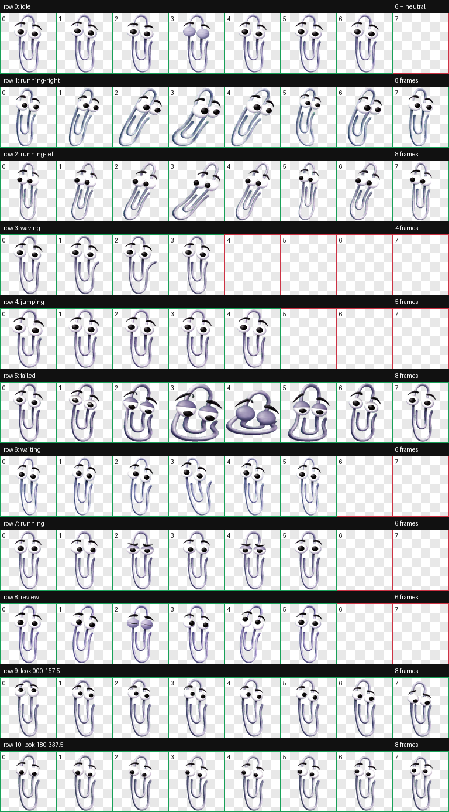

# Clipster

[](LICENSE)
[](https://github.com/adammatthewsteinberger/clipster/actions/workflows/validate.yml)

Clipster is an unofficial, Codex-compatible v2 animated pet inspired by the visual language of classic late-1990s desktop assistants. It provides nine standard animation states, sixteen clockwise look directions, portable source assets, and visual QA evidence.



> [!IMPORTANT]
> This project is not affiliated with or endorsed by Microsoft. The MIT License covers original project contributions only and does not grant trademark rights or rights the author does not own. Read [NOTICE.md](NOTICE.md) before redistributing or using the project commercially.

## Features

- Codex v2 pet contract with `spriteVersionNumber: 2`
- Transparent 1536-by-2288 WebP atlas
- Eight columns by eleven rows using 192-by-208-pixel cells
- Idle, running-right, running-left, waving, jumping, failed, waiting, running, and review states
- Sixteen gaze directions in 22.5-degree clockwise increments
- Source row strips and normalized standard-state frames
- Contact sheets, animated previews, blind direction QA, semantic QA, continuity measurements, and chroma-cleanup evidence
- Local validator and GitHub Actions workflow

## Install

Run the portable installer:

```sh
./scripts/install.sh
```

Or copy the two runtime files manually:

```text
$CODEX_HOME/pets/clipster/
  pet.json
  spritesheet.webp
```

When `CODEX_HOME` is unset, Codex normally uses `.codex` in the current user's home directory. Reload Codex after installation if the pet does not appear immediately.

## Validate

```sh
python3 -m venv .venv
. .venv/bin/activate
python3 -m pip install -r requirements-dev.txt
make validate
```

The validator checks the manifest, sprite contract version, dimensions, alpha channel, path safety, and expected cell occupancy.

## Repository layout

```text
.
├── pet.json                 Codex runtime manifest
├── spritesheet.webp         Final v2 animation atlas
├── source/
│   ├── frames/              Normalized standard-state frames
│   └── row-strips/          Selected generated source strips
├── qa/                      Visual and deterministic QA evidence
├── scripts/
│   ├── install.sh           Portable local installer
│   └── validate.py          Atlas and manifest validator
└── .github/                 CI and contribution templates
```

Atlas rows are idle, running-right, running-left, waving, jumping, failed, waiting, running, review, directions 000–157.5 degrees, and directions 180–337.5 degrees.

## Contributing and support

Clipster uses GitFlow: `main` is release-only, while ordinary feature, fix, documentation, maintenance, and dependency pull requests target `develop`. Release and hotfix branches are merged back into both long-lived branches. Read [CONTRIBUTING.md](CONTRIBUTING.md) for the complete branch and release workflow before submitting changes.

Community behavior is governed by [CODE_OF_CONDUCT.md](CODE_OF_CONDUCT.md). Use GitHub Issues for bugs and feature requests, and follow [SECURITY.md](SECURITY.md) for private vulnerability reports.

## License and attribution

Copyright © 2026 Adam Matthew Steinberger.

Original project contributions are distributed under the [MIT License](LICENSE). See [AUTHORS.md](AUTHORS.md) for attribution and [NOTICE.md](NOTICE.md) for third-party-rights and trademark limitations.
