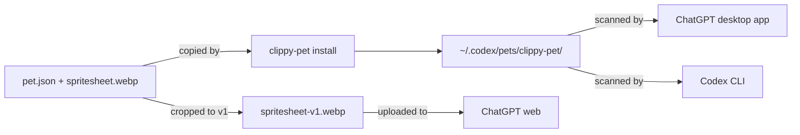

# How it works

It looks like you want to see under the hood. There isn't much of a hood; that's the nice part.

A pet is two files. Everything else in this project exists to make those two files correct, verifiable, and easy to put in the right place.

- **[The pet contract](contract.md)**: `pet.json`, the atlas geometry, v1 versus v2, and where pets live on disk.
- **[QA evidence](qa.md)**: the validator, the blind direction test, semantic review, continuity, chroma cleanup, with the actual numbers.
- **[Repository layout](repository.md)**: what's where and why the runtime tarball is 1.5 MB while the repo is 19 MB.

