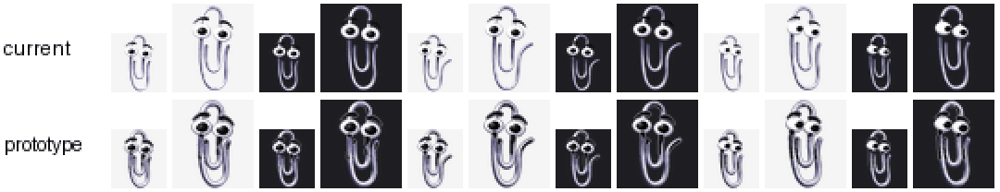

# Designing a tiny variant

<div class="cp-bubble">It looks like you'd like a paperclip that fits in a very small terminal. Here's what the evidence says about drawing one.</div>

This page is the design groundwork for [issue #33](https://github.com/adammatthewsteinberger/clippy-pet/issues/33), a variant that stays legible when a terminal draws the pet about 32 px tall. It answers the issue's two open questions with measurements, shows one prototype test frame, and leaves the drawing to whoever picks it up. The variant itself is *planned*: nothing on this page ships yet.

## Can a tiny variant use smaller cells?

No. The v2 contract fixes the atlas at 1536 × 2288 px, 8 × 11 cells of 192 × 208 ([the pet contract](../how-it-works/contract.md)), and `scripts/validate.py` rejects anything else. The host app does the scaling. A tiny variant therefore has the same geometry and a **bolder character**: shapes drawn so that they survive the app shrinking them about six-fold.

## Which cues survive 32 px?

At 32 px tall the atlas is scaled down about 6.5×, so a feature needs to be roughly 6 px across at full size to cover a single screen pixel. Rendering every animation row at 32 and 64 px over a light and a dark background shows:

| Cue | Size at full scale | At 32 px | Verdict |
|---|---|---|---|
| Pupils | ~12 px | 1–2 px dots | Survive, barely; enlarge them |
| Eye whites | ~30 px | clear | Survive |
| Wire (body) | ~8–10 px strokes | faint 1 px lines on light backgrounds | Thicken |
| Eyebrows | ~5 px, near-black | gone on dark backgrounds, **also at 64 px** | Thicken and give them a light edge |
| Arm in *waving*, pose in *jumping* | small displacements | mostly lost | Simplify and exaggerate |
| Shallow look diagonals | 3–4 px pupil offsets | at the edge of legibility | See the [QA recheck](../how-it-works/qa.md#look-frame-retouch-and-blind-recheck-issue-29) |

The eyebrow row is the finding that matters beyond this variant: on a dark terminal, the near-black eyebrows have no value contrast against the background, so dark-theme users lose half of every expression at small sizes today.

## A prototype test frame

[`scripts/prototype-tiny-frame.py`](https://github.com/adammatthewsteinberger/clippy-pet/blob/develop/scripts/prototype-tiny-frame.py) applies those fixes to one cell automatically: 2 px thicker wire, pupils scaled 1.35×, bolder eyebrows with a 1 px light edge, and a 1 px dark outline. The result is a probe for discussion, not art to ship.

{ loading=lazy }

What it shows:

- **Silhouette and value contrast carry small sizes, not detail.** The prototype reads on both backgrounds at 32 px, and the eyebrows are visible on dark.
- **Boldness costs identity.** Growing the wire starts to fill the paperclip's see-through loops, and the character gets heavier. A hand-drawn variant should thicken strokes *without* closing the gaps between loops; an automatic pass can't make that judgement.
- **Motion needs its own simplification.** The prototype fixes still frames; the waving arm still gets lost. Tiny animations probably want fewer, larger poses.

## Judge your own drawing

```sh
python3 scripts/preview-at-size.py preview.png --cells 0:6 3:2 9:4 --heights 32 48 64
```

`preview-at-size.py` needs only Pillow. It renders any cells at the heights you choose over a light and a dark background and enlarges the result pixel-for-pixel, so you can see exactly what a small terminal will draw. The prototype script needs `numpy` and `scipy` as well.

## Picking it up

Comment on [#33](https://github.com/adammatthewsteinberger/clippy-pet/issues/33) with one hand-drawn test frame and its preview at 32 px on both backgrounds. Once the direction is agreed, the variant lives in `variants/tiny/` with its own `pet.json` (id `clippy-pet-tiny`) and follows [Submit a variant](submit.md).
